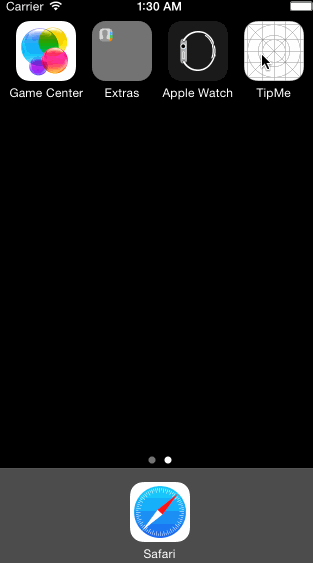
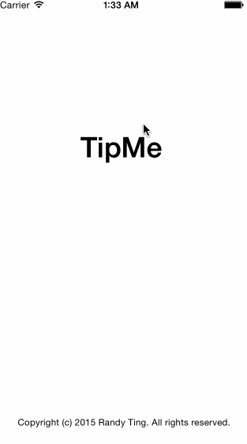
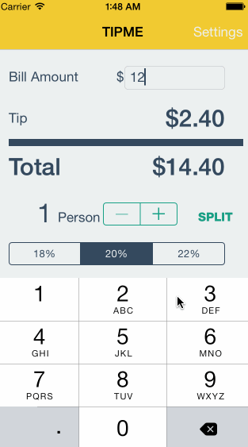

# TipCalculator

This is a Tip Calculator application for iOS submitted as the [pre-assignment](https://gist.github.com/timothy1ee/7747214) requirement for CodePath.

Time spent: 18 hours spent in total

Completed:

* [x] Required: User can enter a bill amount, choose a tip percentage, and see the tip and total values.
* [x] Required: Settings page to change the default tip percentage.
* [x] Optional: UI animations
* [x] Optional: Remembering the bill amount across app restarts (if <10mins)
* [x] Optional: Using locale-specific currency and currency thousands separators.
* [x] Optional: Making sure the keyboard is always visible and the bill amount is always the first responder. This way the user doesn't have to tap anywhere to use this app. Just launch the app and start typing.
* [x] Additional: Added Dark color theme to settngs page.
* [x] Additional: Added modal segue from table view row selection. 
* [x] Additional: Added split check view for making sure everyone pays their fair share of the bill.

Notes:

App only works in portrait mode. It's storyboard is laid out only for iPhone 5.  Other devices may have some alignment/visibility problems.

Walkthrough of required user stories:

Walkthrough of optional user stories:

Walkthrough of additional user stories:

Repository License:

This project is licensed under the terms of the MIT license.

GIF created with [LiceCap](http://www.cockos.com/licecap/)

Doge pictures created with [such doge - much generator - wow](http://dogr.io/)

Colors from [UI Flat Colors](https://flatuicolors.com/)
